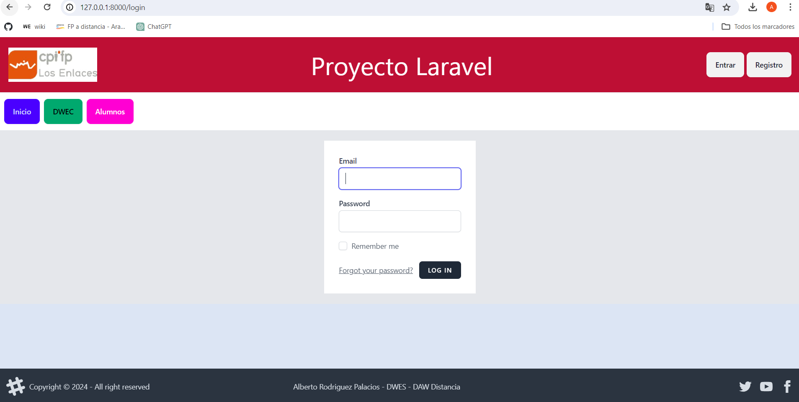
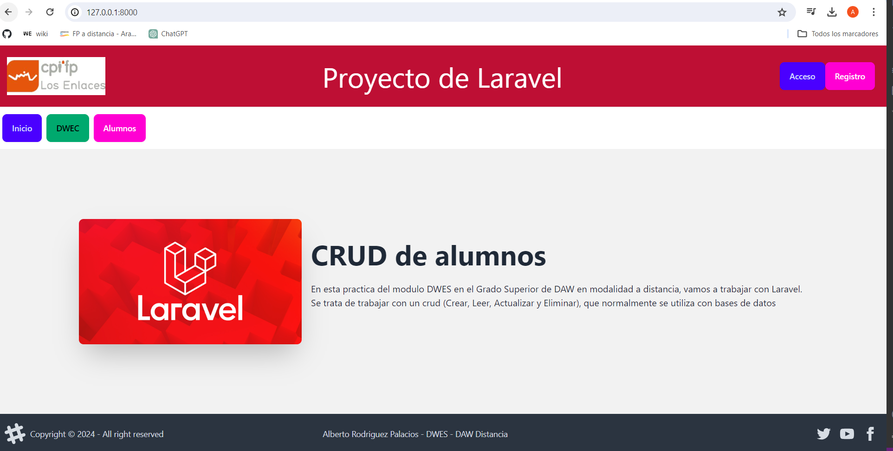
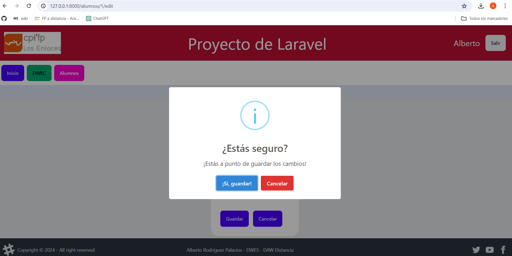
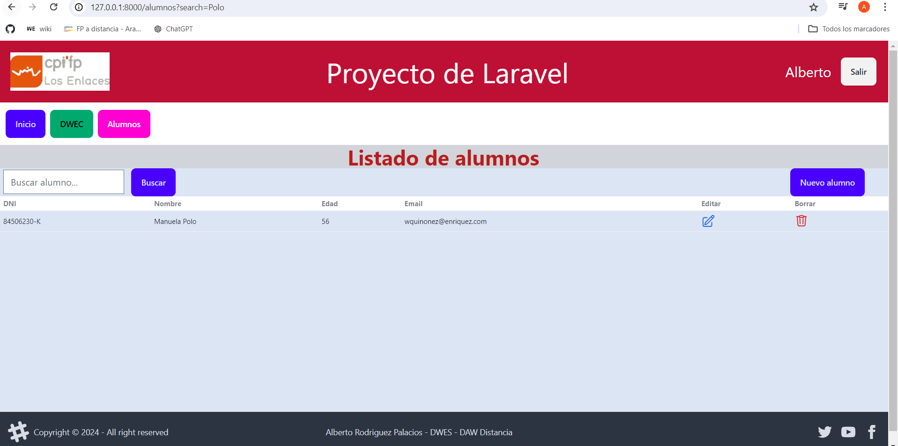

# Proyecto_Laravel
Práctica de Laravel

## Pasos previos
- Instalar composer y laravel: [Descargar Composer](https://getcomposer.org/Composer-Setup.exe)
- Desde Consola o PowerShell con privilegios de administrador, ejecutar el siguiente comando: `composer global require laravel/installer`
- Preparar el IDE, en este caso PhpStorm, e instalar los siguientes plugins útiles desde `Settings -> Plugins`:
    - Atom Material Icons
    - Laravel Idea

### Crear el proyecto
- Crear el proyecto Laravel: `composer create-project laravel/laravel Proyecto_Laravel`
- Alternativamente, desde Laravel: `laravel new Proyecto_Laravel`
- Seguir el proceso de instalación para seleccionar las opciones deseadas.

### Clonar el repositorio git
- Crear una carpeta y clonar el repositorio git:
  ```
  git clone <URL_del_repositorio>

### Crear rama develop
```
git checkout -b "develop"
```

### Añadir los archivos y poner un comentario (esto se hará frecuentemente para tener el repositorio actualizado)
```
git checkout -b develop
git add .
git commit -m "Inicio practica Laravel"
```

### Hacer el push
```
git push -u origin develop
```

### Hacer merge
Ir al repositio y seguir los pasos para Compare&Pull request y luego merge.

### Comprobar la instalación
Para comprobar que Laravel se ha instalado correctamente y ver información sobre la aplicación, puedes ejecutar el siguiente comando desde la terminal, estando ubicado en el directorio de tu proyecto Laravel (en este caso, `Proyecto_Laravel`):

```
php artisan about
```
### Arancar el servidor
```
php artisan serve
```
```
http://127.0.0.1:8000/
```


## Crear nuestra web

## Generar index.blade.php 

En resources/views/ creamos nuestra estructura básica de web:
```
<!DOCTYPE html>
<html lang="en">
<head>
    <meta charset="UTF-8">
    <meta name="viewport" content="width=device-width, user-scalable=no, initial-scale=1.0">
    <meta http-equiv="X-UA-Compatible" content="ie=edge">
    <title>Title</title>
</head>
<body>
<header><h1 ">Esta es mi página principal</h1></header>
<hr />
<nav>
    Menu
</nav>

<main>
    Parte Principal
</main>

<footer>
    Footer
</footer>
</body>
```
### Crear MainController

Hay que crear el controlador principal de nuestra web (MainController):
```
php artisan make:controller MainController
```

Y despues agregarle esto:

```
public function index (){

        return view ('index');
    }

```

### Modificar fichero de rutas

Debemos modificas el fichero Routes/web.php para que encuentre las rutas correctamente.
Al principio añadimos el directorio para referenciarlo:
```
use \App\Http\Controllers\MainController; 
```

Despues agregamos nuestra ruta:
```
Route::get('/', [MainController::class, 'index'])->name('main');
```

Y para hacer que nuestra web sea la inicial comentamos estas lineas:
```
/*Route::get('/', function () {
    return view('welcome');
})*/


```


## Para darle formato a la web

### Descargar e instalar node.js (tambien se instalará npm)
```
https://nodejs.org/en
```

### Descargar e instalar breeze
Tambien se instala tailwindcss para dar formato. Hay que tener en cuenta que hay que estar en el directorio del proyecto.

NOTA: Al instalar sobreescribe el fichero web.php, por lo que debemos hacer una copia si queremos conservar lo que tiene configurado para agrgarlo posteriormente.

```
composer require laravel/breeze
```

Si se ha instalado bien debe crearse la carpeta en vendor/laravel/breeze
Lo tenemos instalado pero no disponible, para eso necesitamos ejecutar:
```
php artisan breeze
```
Selecionaremos:
* Blade
* No modo dark
* PHPinit.

  Con eso ha instalado los controladores, las vistas y las rutas por defecto para login, register, etc...
  Las vistas/webs se pueden modificar a nuestra conveniencia todo a excepto de las variables.

### Tailwindcss y @vite

Podemos aplicar distintos estilos que tiene añadidos taildwindcss, pero para que compile los estilos  y se apliquen debemos ejecutar en el terminal.

```
npm run dev
```

Tambien podemos crear los nuestro propios, eso se hace en el fichero taildwind.config.js

```
height:{
  "10v":"10vh",
  "15v":"15vh",
  "65v":"65vh"
},
colors:{
  'header': "#BE0F34",
  'nav': "#FFFFFF",
  'main':"#DCE5F4",
  'footer':"#E5E5E5"
},
```
Ademas debemos referencias el fichero en nuestro html con:

```
@vite("resources/css/app.css")
```

### Aplicar los estilos a nuestro index.blade.php

```
<!DOCTYPE html>
<html lang="en">
<head>
    <meta charset="UTF-8">
    <meta name="viewport" content="width=device-width, user-scalable=no, initial-scale=1.0">
    <meta http-equiv="X-UA-Compatible" content="ie=edge">
    <title>Title</title>
    @vite("resources/css/app.css")
</head>
<body>
<header><h1 class="h-15v bg-header">Esta es mi página principal</h1></header>
<hr />
<nav CLASS="h-10 bg-nav">
    Menu
</nav>

<main class="h-65v bg-main">
    Parte Principal
</main>

<footer class="h-10v bg-footer">
    Footer
</footer>
</body>
</html>
```


## Layouts

El siguiente paso es crear los layouts para nuestra web, ya que queremos que todos las distintas partes tengan la misma parariencia, este mejor estructurado el codigo y sea más facil de mantener.

Mover index.blade.php a una carpeta creada dentro de views/components/layouts y renombrarlo a layout.blade.php

Crear en views/index.blade.php
```
<x-layouts.layout>
    <h1>Esta es la parte main</h1>
</x-layouts.layout>
```

Y en layout.blade.php cambiar en main por la variable, para refenciarlo.
``` 
<main class="h-65v bg-main">
    {{$slot}}
</main>
```

Cortar el contenido de header de layout.blade.php  y sustituirlo por esto:
```
<x-layouts.header/>
```
Crear layout para layouts/header.blade.php con lo que hemos cortado anteriormente.
```
<header> 
  Proyecto Laravel
</header>
Hacemos lo mismo con nav, quitamos el contenido de nav de layout.blade.php  y lo sustituimos por esto:
```
<x-layouts.nav/>
```
Crear layout para layouts/nav.blade.php

```
<nav>
  Menu
</nav>

Ya solo queda el footer, creamos el archivo footer.blade.php y en layout.blade.php sustituimos el footer por esto:
```
<x-layouts.footer/>
```

### Instalamos Daisyui para dar estilos a nuestra web y botones
Se instala desde el terminal con:
```
npm i -D daisyui@latest
```

Agregarlo a plugins en tailwind.config.php 

```
plugins: [forms, require('daisyui')],
```

Una vez hecho esto, vamos a la web y seleccionamos lo que queremos (asi con copiar y pegar tenemos nuestros estilos)
```
https://daisyui.com/components/button/
```

#### En el header
Agregamos el Logo.png y lo guardamos en carpeta public/images/Logo.png y le damos formato
```
<header class="h-15v bg-header p-5 flex justify-between items-center">
    
    <h1 class="text-5xl text-white" >CRUD de alumnos</h1>
    <div>
        <a class=" btn btn-warning">Entrar</a>
        <a class=" btn btn-warning">Registro</a>
    </div>
</header>

```

#### En el nav

Agregar los botones que necesitamos para el menu y dar forma:
```
<nav class="h-15vv bg-nav flex flex-row justify-start items-center space-x-2 p-3">
    <a class="btn btn-primary" href="">Inicio</a>
    <a class="btn btn-secondary" href="">Alumnos</a>
    <a class="btn btn-success" href="">Proyectos</a>
</nav>
```

### Agregamos contenido a nuestro index.blade.php

Buscamos en Dasyui y agregamos el contenido al cuerpo de nuestro index

```
<x-layouts.layout>
    <div class="hero h-full bg-base-200">
        <div class="hero-content flex-col lg:flex-row">
            
            <div>
                <h1 class="text-5xl font-bold">Box Office News!</h1>
                <p class="py-6">Provident cupiditate voluptatem et in. Quaerat fugiat ut assumenda excepturi exercitationem quasi. In deleniti eaque aut repudiandae et a id nisi.</p>
                <button class="btn btn-primary">Get Started</button>
            </div>
        </div>
    </div>
</x-layouts.layout>
```
### En el footer

Volvemos a buscar a Daisyui y escogemos el que mas nos giuste, lo agregamos a footer.blade.php dentro de layouts
```
<footer class="footer items-center p-4 bg-neutral text-neutral-content">
    <aside class="items-center grid-flow-col">
        <svg width="36" height="36" viewBox="0 0 24 24" xmlns="http://www.w3.org/2000/svg" fill-rule="evenodd" clip-rule="evenodd" class="fill-current"><path d="M22.672 15.226l-2.432.811.841 2.515c.33 1.019-.209 2.127-1.23 2.456-1.15.325-2.148-.321-2.463-1.226l-.84-2.518-5.013 1.677.84 2.517c.391 1.203-.434 2.542-1.831 2.542-.88 0-1.601-.564-1.86-1.314l-.842-2.516-2.431.809c-1.135.328-2.145-.317-2.463-1.229-.329-1.018.211-2.127 1.231-2.456l2.432-.809-1.621-4.823-2.432.808c-1.355.384-2.558-.59-2.558-1.839 0-.817.509-1.582 1.327-1.846l2.433-.809-.842-2.515c-.33-1.02.211-2.129 1.232-2.458 1.02-.329 2.13.209 2.461 1.229l.842 2.515 5.011-1.677-.839-2.517c-.403-1.238.484-2.553 1.843-2.553.819 0 1.585.509 1.85 1.326l.841 2.517 2.431-.81c1.02-.33 2.131.211 2.461 1.229.332 1.018-.21 2.126-1.23 2.456l-2.433.809 1.622 4.823 2.433-.809c1.242-.401 2.557.484 2.557 1.838 0 .819-.51 1.583-1.328 1.847m-8.992-6.428l-5.01 1.675 1.619 4.828 5.011-1.674-1.62-4.829z"></path></svg>
        <p>Copyright © 2024 - All right reserved</p>
    </aside>
    <nav class="grid-flow-col gap-4 md:place-self-center md:justify-self-end">
        <a><svg xmlns="http://www.w3.org/2000/svg" width="24" height="24" viewBox="0 0 24 24" class="fill-current"><path d="M24 4.557c-.883.392-1.832.656-2.828.775 1.017-.609 1.798-1.574 2.165-2.724-.951.564-2.005.974-3.127 1.195-.897-.957-2.178-1.555-3.594-1.555-3.179 0-5.515 2.966-4.797 6.045-4.091-.205-7.719-2.165-10.148-5.144-1.29 2.213-.669 5.108 1.523 6.574-.806-.026-1.566-.247-2.229-.616-.054 2.281 1.581 4.415 3.949 4.89-.693.188-1.452.232-2.224.084.626 1.956 2.444 3.379 4.6 3.419-2.07 1.623-4.678 2.348-7.29 2.04 2.179 1.397 4.768 2.212 7.548 2.212 9.142 0 14.307-7.721 13.995-14.646.962-.695 1.797-1.562 2.457-2.549z"></path></svg>
        </a>
        <a><svg xmlns="http://www.w3.org/2000/svg" width="24" height="24" viewBox="0 0 24 24" class="fill-current"><path d="M19.615 3.184c-3.604-.246-11.631-.245-15.23 0-3.897.266-4.356 2.62-4.385 8.816.029 6.185.484 8.549 4.385 8.816 3.6.245 11.626.246 15.23 0 3.897-.266 4.356-2.62 4.385-8.816-.029-6.185-.484-8.549-4.385-8.816zm-10.615 12.816v-8l8 3.993-8 4.007z"></path></svg></a>
        <a><svg xmlns="http://www.w3.org/2000/svg" width="24" height="24" viewBox="0 0 24 24" class="fill-current"><path d="M9 8h-3v4h3v12h5v-12h3.642l.358-4h-4v-1.667c0-.955.192-1.333 1.115-1.333h2.885v-5h-3.808c-3.596 0-5.192 1.583-5.192 4.615v3.385z"></path></svg></a>
    </nav>
</footer>
```


Personalización de la web


## Botones Entrar y Registro

Vamos a header y referenciamos los botones Entrar y Registro con las paginas correspondientes (Login y Register) que nos ha instalado Breeze.

```
<a href="/login" class="btn btn-poutline-warning">Entrar</a>

<a href="/register" class="btn btn-poutline-warning">Registro</a>

```

Una vez hecho esto debemos darle a los apartados de registro y entrar la misma apariencia que nuestra web agregando las etiquetas de <x-layouts.layout> al inicio y </x-layouts.layout> al final.

Además le damos el formato que queremos a cada uno de los formularios para que se vean mejor.

En la web de entrar, creamos un div que envuelva el formulario:

```
<div class="flex flex-row justify-center p-5 bg-gray-200 ">
```

En el formulario:
```
<form method="POST" action="{{ route('login') }}" class="bg-white p-7 rounded-3xl">
```
Y ahora hacemos lo mismo con registro, poner el layout y dar formato.

```
<div class="flex flex-row justify-center p-5 bg-gray-200 ">
´´´

En el formulario:
```
<form method="POST" action="{{ route('register') }}" class="bg-white p-7 rounded-3xl">
```



## La base de datos MYSQL

### Crear fichero docker compose

Primero deberemos crear un fichero Proyecto_laravel/docker-compose.yaml .

```
version: "3.9"
services:
  mysql:
    image: mysql
    volumes:
      - ./mysql:/var/lib/mysql
    ports:
      - 33306:3306
    environment:
      - MYSQL_ROOT_PASSWORD=${DB_PASSWORD_ROOT}
      - MYSQL_DATABASE=${DB_DATABASE}
      - MYSQL_USER=${DB_USERNAME}
      - MYSQL_PASSWORD=${DB_PASSWORD}

  phpmyadmin:
    image: phpmyadmin
    ports:
      - 8080:80
    environment:
      - PMA_HOST=mysql
      - PMA_ARBITRARY=1
    depends_on:
      - mysql
```

### Modificar .env

Debemos agregar los parametro de configuración de nuestra base de datos descomentando y completando las siguientes lineas:

```
DB_CONNECTION=mysql
DB_HOST=127.0.0.1
DB_PORT=33306
DB_DATABASE=laravel
DB_USERNAME=alberto
DB_PASSWORD=alberto
DB_PASSWORD_ROOT=root
```
Por último, al final del fichero .gitignore agregamos:

```
/mysql
```

Ahora como estoy en windows, hay que ejecutar Docker Desktop con privilegios de administrador.

Una vez abierto en el terminal ejecutamos:

```
docker compose up
```

Tenemos dos formas de comprobar que se ha realizado bien la tarea.

Desde la web con el usuario y contraseña que hemos indicado en el archiv .env (en mi caso alberto - alberto).

```
http://localhost:8080/
```


Por comandos, desde cmd entrando al docker creado.

```
docker exec -it proyecto_laravel-mysql-1 bash
```

Y conectando con la base de datos.

```
mysql -u alberto -p
```

Ver que se ha creado correctamente la base de datos.

```

SHOW DATABASES;

```


### Migración

Ahora tenemos que generar la migración, debemos ejecutar:

```
php artisan make:migration alumnos --create=alumnos
```
Una vez ejecutado se nos crea en database/migrations/ una migracion alumnos

Solo esta id , pero creamos todos los campos que necesitemos en nuestra tabla:

```

Schema::create('alumnos', function (Blueprint $table) {
    $table->id();
    $table->string('nombre');
    $table->integer('edad');
    $table->string('email');
    $table->timestamps();
});
```
Despues ejecutamos el siguiente comando para ejecutar las migraciones.
```
php artisan migrate
```

Nota: si queremos modificar algún campo de las tablas, tenemos que ejecutar el siguiente comando, que borra todos los campos y los vuelve a crear

```
php  artisan migrate:fresh 
```

## Registro de usuarios

Ahora ya tenemos todo listo para poder registrar usuarios. 

Lo único que debemos cambiar en app/Http/controllers/Auth/

AuthenticatedSessionController.php:

Para cuando hagagamos:
```
return redirect()->intended(route('main', absolute: false));
```

RegisteredUserController.php:

```
 return redirect(route('main', absolute: false));
 ```

Esto es para que una vez registrados o logueados nos lleve a la pagina de incio.

En el header tambien  se realizan cambiando para muestre los botones Entrar y Registrar sin estar logueado (en modo invitado):

```
@guest 
<a href="/login" class="btn btn-primary">Acceso</a>
<a href="/register" class="btn btn-secondary">Registro</a>
@endguest
```


Y el nombre del usuario y el boton Salir una vez que nos hemos logueado.
```
@auth 
  <h1 class="text-2xl text-white mr-4">{{ auth()->user()->name }}</h1>
  <form action="{{ route("logout") }}" method="POST">
   <input class="btn btn-glass" type="submit" value="Salir">
  </form>
@endauth
```


Además hay que corregir un error, porque cuando le damos s Salir no nos lleva a nuestra pagina inicial, esto es por seguridad al venir desde un formulario y evitar posibles ataques. Para solucionarlo debemos poner un token en el header dentro del formulario logout.
```
@auth 
  <h1 class="text-2xl text-white mr-4">{{ auth()->user()->name }}</h1>
  <form action="{{ route("logout") }}" method="POST">
    @csrf 
   <input class="btn btn-glass" type="submit" value="Salir">
  </form>
@endauth
```

## Modelo de datos

Ahora hay que generar un nuevo modelo de datos para poder trabajar con alumnos, para ello utilizamos el siguiente comando que nos crea todo lo necesario para hacerlo (modelo, controlador, factoria,...):

```
php artisan make:model Alumno --all
```

Despues hay que agregar la ruta :

```
Route::resource("alumnos", \App\Models\Alumno::class);
```

Despues en database/factories/AlumnoFactory.php necesitamos crear los registros en nuestra base de datos (DNI, nombre, edad, email), para eso tendremos que anañir :

```
public function definition(): array
{
    return [
        "nombre" => $this->faker->name(),
        "email" => $this->faker->email(),
        "edad" => $this->faker->numberBetween(15, 80),
        "DNI" => $this->get_dni(),

    ];
}
´´´
Uitlizaremos esta función para generar los DNI:

´´´
private function get_dni(): string
{
    $number = $this->faker->numberBetween(10000000, 99999999);
    $letras = "TRWAGMYFPDXBNJZSQVHLCKE";
    $letra = $letras[$number % 23];
    return "$number-$letra";
}
```

Una vez que tenemos la fabrica (para crearnos los datos), en el seeder debemos invocar un numero de veces a factory para crear 50 registros.

```
<?php

namespace Database\Seeders;

use App\Models\Alumno;
use Illuminate\Database\Console\Seeds\WithoutModelEvents;
use Illuminate\Database\Seeder;

class AlumnoSeeder extends Seeder
{
    /**
     * Run the database seeds.
     */
    public function run(): void
    {
        Alumno::factory(50)->create();
        //
    }
}
```

Y por ultimo en databaseseeeder tenemos que llamar a la factoria que hemos creado:

```
$this->call([ AlumnoSeeder::class]);
```

Ya solo queda indicar en el .env que nos cree los nombres en castellano, cambiando el idioma en la siguiente línea:

```
APP_FAKER_LOCALE=es_ES
```

Ahora necesitamos ejecutar la factoria para que cree los registros y complete la base de datos. Hay que poner fresh para que borre los datos existentes y  --seed para que después de hacer la migración haga las poblaciones. 

```
php artisan migrate:fresh --seed
```


Ahora para poder mostar los alumnos necesitamos crear en el controlador la función que nos pase el array con todos los alumnos:

```
  public function index()
    {
        $alumnos = Alumno::all();
        return view('alumnos.index',compact('alumnos'));
        //
    }
```

Debemos crear las ruta en el fichero web.php

```
Route::resource("alumnos", \App\Http\Controllers\AlumnoController::class);
```

Tambien modificar el nav para que el botón alumnos nos muestre el listado y he agregado la opcion de que solo se muestre si estas logueado:

```
@auth
        <a href="{{route("alumnos.index")}}" class=" btn btn-secondary" href="">Alumnos</a>
    @endauth
```

El siguiente paso es generar la vista donde podremos visualizar nuestros alumnos, vamos a resource/views/alumnos/index.blade.php

```
<x-layouts.layout>
    <div class="overflow-x-auto h-full">
        <table class="table table-xs table-pin-rows table-pin-cols">
            <caption>Listado de alumnos</caption>
            <thead>
            <tr>
                <th>DNI</th>
                <th>Nombre</th>
                <th>Edad</th>
                <th>Email</th>
            </tr>
            </thead>
            <tbody>
            @foreach($alumnos as $alumno)
                <tr>
                    <td>{{$alumno->DNI}}</td>
                    <td>{{$alumno->nombre}}</td>
                    <td>{{$alumno->edad}}</td>
                    <td>{{$alumno->email}}</td>
                </tr>
            @endforeach
            </tbody>
        </table>
    </div>
</x-layouts.layout>
```


## Agregar, editar y borrar nuevos alumnos

Primero debemos empezar por modificar nuestra apariencia, empezamos por la tabla para agregar el boton nuevo alumno.

```
<x-layouts.layout>
    <h1 class="text-4xl text-red-700 text-center font-bold bg-gray-300">Listado de alumnos</h1>
    <div class="overflow-x-auto h-full">
        <table class="table table-xs table-pin-rows table-pin-cols">
            <thead>
```

Agregar un ancla alumno, para luego referenciar donde tiene que ir mediante href, debajo de listado de alumnos.

```
<a class="btn btn-primary mx-10">Nuevo alumno</a>
```

Despues agregamos a nuestra tabla dos columnas para los campos de editar y borrar.
```
<th>DNI</th>
<th>Nombre</th>
<th>Edad</th>
<th>Email</th>
<th>Editar</th>
<th>Borrar</th>
```

Dentro del bucle foreach, para que aparezcan al lado de cada alumno, creamos los dos nuevos campos. Para darle formato a los campos, en vez de poner el nombre vamos a https://heroicons.com/, buscamos el icono que queremos poner y copiamos y pegamos el código svg. Podemos personalizar el color, tamaño,…:

```
<td>
    <button>
        <svg xmlns="http://www.w3.org/2000/svg" fill="none" viewBox="0 0 24 24" stroke-width="1.5" stroke="currentColor" class="w-6 h-6">
            <path stroke-linecap="round" stroke-linejoin="round" d="m16.862 4.487 1.687-1.688a1.875 1.875 0 1 1 2.652 2.652L10.582 16.07a4.5 4.5 0 0 1-1.897 1.13L6 18l.8-2.685a4.5 4.5 0 0 1 1.13-1.897l8.932-8.931Zm0 0L19.5 7.125M18 14v4.75A2.25 2.25 0 0 1 15.75 21H5.25A2.25 2.25 0 0 1 3 18.75V8.25A2.25 2.25 0 0 1 5.25 6H10" />
        </svg>

    </button>
</td>
<td>
    <button>
        <svg xmlns="http://www.w3.org/2000/svg" fill="none" viewBox="0 0 24 24" stroke-width="1.5" stroke="currentColor" class="w-6 h-6">
            <path stroke-linecap="round" stroke-linejoin="round" d="m14.74 9-.346 9m-4.788 0L9.26 9m9.968-3.21c.342.052.682.107 1.022.166m-1.022-.165L18.16 19.673a2.25 2.25 0 0 1-2.244 2.077H8.084a2.25 2.25 0 0 1-2.244-2.077L4.772 5.79m14.456 0a48.108 48.108 0 0 0-3.478-.397m-12 .562c.34-.059.68-.114 1.022-.165m0 0a48.11 48.11 0 0 1 3.478-.397m7.5 0v-.916c0-1.18-.91-2.164-2.09-2.201a51.964 51.964 0 0 0-3.32 0c-1.18.037-2.09 1.022-2.09 2.201v.916m7.5 0a48.667 48.667 0 0 0-7.5 0" />
        </svg>

    </button>
</td>
```

Ahora toca dotar de funcionalidad los nuevo botones.En el botón Nuevo alumno, agregamos la ruta del método que queremos ejecutar, en nuestro caso create.

```
<a href={{route("alumnos.create")}} class="btn btn-primary mx-10">Nuevo alumno</a>
```
Despues en el controlador AlumnoController.php agregaremos al método create la vista del formulario para crear los alumnos.

```
public function create()
{
    return view ("alumnos.create");
    //
}
```

Ahora vamos a crear la vista del formulario en la carpeta alumno dentro de resources/views/alumno/create.blade.php, llamando al metodo alumnos.store para guardar los datos en la base de datos.
```
<x-layouts.layout>
    <h1 class="text-4xl text-red-600 font-bold flex flex-row justify-center">Alta nuevos alumnos</h1>
    <div class="flex flex-row justify-center p-5 bg-gray-200 ">

        <form method="POST" action="{{ route('alumnos.store') }}" method="POST" class="bg-white p-7 rounded-3xl">
            @csrf
            <x-input-label for="nombre">
                Nombre
            </x-input-label>
            <x-text-input name="nombre" />
            <x-input-label for="DNI">
                DNI
            </x-input-label>
            <x-text-input name="DNI" />
            <x-input-label for="email">
                Email
            </x-input-label>
            <x-text-input name="email" />
            <x-input-label for="edad">
                Edad
            </x-input-label>
            <x-text-input name="edad" />
            <br/>
            <button class="btn btn-primary mx-2 mt-10 p-100 " type="submit" value="Guardar">Guardar</button>
            <button class="btn btn-primary mx-2  mt-10 p-100" type="submit" value="Cancelar">Cancelar</button>


        </form>
    </div>
</x-layouts.layout>
```


Para poder guardar los datos, por seguridad Laravel bloquea el acceso al guardado y para que nos permita hacerlo debemos cambiar en Requests/StoreAlumno.php la función authorize a true.
```
public function authorize(): bool
{
    return true;
}
```

Añadir al modelo alumno.php los campos que le van a llegar cuando se cree el alumno, tenemos que especificar que campos le van a llegar.
```
class Alumno extends Model
{
    use HasFactory;

    protected $fillable = ['nombre', 'DNI', 'edad', 'email'];

}
```

Ahora  en AlumnoController.php y completar la función store que actualmente está vacía para que coja los datos, y cree un nuevo alumno, devolviéndonos al listado general una vez agregado.

```
public function store(StoreAlumnoRequest $request)
{
    $datos=$request->input();
    $alumno= new Alumno($datos);
    $alumno->save();
    return redirect()->route('alumnos.index');
    //
}
```

NOTA: Hemos indicado que coja todo el array, pero laravel internamente lo gestiona de manera que solo va a aguardar los campos que hemos permitido en el paso anterior en alumno.php

Aunque ya lo guarda, debemos crear unas reglas minimas de validación para evitar luego errores. Esto se hace en request/StoreAlumnoRequest.php en la función rules. En la validación hacemos que los 3 campos sean obligatorios con required, indicamos que tipo de datos deben contener (string, integer), el email no puede estar duplicado (unique) y la edad debe estar entre 10 y 100 (between).

```
public function rules(): array
{
    return [
        "nombre"=>"string|required|min:5|max:50",
        "email"=>"string|required|unique:alumnos",
        "edad" => "integer|between:10,100",
        "DNI" => 'required|string',
        //
    ];
}
```

Ahora para poder comprobar mas facilmente que insertar registros funciona, se borran todos los registros y se crearan solo 5 cambiando database/seeders/AlumnoSeeder.php

```
Alumno::factory(5)->create();
```

Y ejecutamos para que cree los nuevos registros.

```
php artisan migrate:fresh --seed
```


Para mostrar un mensaje si no se cumple con la validación del campo, debemos poner debajo de cada cuadro de texto la condición para que nos la muestre

```
@if($errors->get("nombre"))
    @foreach($errors->get("nombre") as $error)
        <div class="text-sm text-red-600">
            $error

        </div>
    @endforeach
@endif
```

Para que los mensajes de error salgan en castellano, hay que instalar el paquete de idiomas desde el terminal.

```
composer require laravel-lang/Lang
```

Nos aparecerá la carpeta laravel-lang/Lang, que ahora debemos publicarla para poder utilizarla.

```
php artisan lang:publish
```

Ahora nos aparece la carpeta en nuestro proyecto lang, pero solo esta ingles, para poder tener castellano debemos agregarlo desde el terminal.

```
php artisan lang:add es
```

Y ya solo queda ir al fichero de configuración .env y cambiar el idioma.

```
APP_LOCALE=es
```

Además agregamos value=”{{(old(‘nombre’)}}” para que en caso de error nos mantenga los últimos campos escritos en el formulario y no debamos volver a completarlo.

```
<x-text-input name="nombre" value="{{ old('nombre') }}" />
```

Y para que el botón cancelar nos devuelva al listado lo referenciamos.

```
<a href="{{ route('alumnos.index') }}" class="btn btn-primary mx-2 mt-10">Cancelar</a>
```

Para que nos muestre un mensaje como que se ha guardado el alumno, en -AlumnoController.php  creamos una variable de sesión.

```
session()->flash("status", "Se ha creado el alumno $alumno->nombre");
```
Y ahora la referenciamos desde index.blade.php de alumnos debajo del titulo. Para darle formato a la ventana de alert buscamos en daisyui un diseño que nos encaje.

```
    @if (session()->has("status"))
        <div role="alert" class="alert alert-success">
            <svg xmlns="http://www.w3.org/2000/svg" class="stroke-current shrink-0 h-6 w-6" fill="none"
                 viewBox="0 0 24 24">
                <path stroke-linecap="round" stroke-linejoin="round" stroke-width="2"
                      d="M9 12l2 2 4-4m6 2a9 9 0 11-18 0 9 9 0 0118 0z"/>
            </svg>
            <span>{{ session()->get("status") }}</span>
        </div>
    @endif
```

Como ya podemos crear alumnos, ahora vamos a configurar la edición de uno creado. Primero tenemos que referenciar alumno.edit dentro del botón editar que había personalizado desde daisyui.

```
<a href="{{route("alumnos.edit", $alumno->id)}}">
```

Despues creamos dentro de alumno, la vista de edición : edit.blade.php
Copiamos el formulario de alta de nuevos alumnos y modificamos el route del formulario.

```
<form method="POST" action="{{ route('alumnos.update', $alumno->id) }}" class="bg-white p-7 rounded-3xl">
```

Agregamos el método por el cual vamos a actualizar PUT (envia todos los datos) o PATCH (solo los seleccionados.

```
@method('PUT')
```

Y decimos a  los campos del formulario que nos muestre el valor actual de la variable $alumno.

```
<x-text-input name="nombre" value="{{ $alumno->nombre }}" />
```

Aplicamos la lógica al controlador.

```
public function update(UpdateAlumnoRequest $request, Alumno $alumno)
{
    $datos= $request -> input();
    $alumno-> update($datos);
    session()->flash ("status", "Se ha actualizado el alumno $alumno -> id");
    return redirect() -> route('alumnos.index');
    //
}
```

Ahora debemos permitir el update en request porque si no nos va a decir operación no autorizada

```
public function authorize(): bool
{
    return true;
}
```

Y copiamos las validaciones del Store para que tengan que cumplir los mismos requeridos, quitando unique de email, porque sino no nos dejará actualizar.

```
return [
    "nombre"=>"string|required|min:5|max:50",
    "email"=>"string|required",
    "edad" => "integer|required|between:10,100",
    "DNI" => 'required|string',
    //
];
```

### -ventana emergente para confirmar guardado

Vamos a instalar sweet alert

```
npm install sweetalert2
```

Ahora en edit.blade.php modificamos el botón guardar con el evento onclick de javascript

```
<button class="btn btn-primary mt-10" type="button" onclick="confirmacionGuardado()>Guardar</button>
```

Y por ultimo debajo del layout ponemos el código del botón que hemos cogido de sweetalert2

```
<script src="https://cdn.jsdelivr.net/npm/sweetalert2@10"></script>
<script>
    function confirmacionGuardado() {
        Swal.fire({
            title: '¿Estás seguro?',
            text: '¡Estás a punto de guardar los cambios!',
            icon: 'info',
            showCancelButton: true,
            confirmButtonColor: '#3085d6',
            cancelButtonColor: '#d33',
            confirmButtonText: '¡Sí, guardar!',
            cancelButtonText: 'Cancelar'
        }).then((result) => {
            if (result.isConfirmed) {
                document.getElementById('editForm').submit();
            }
        });
    }
</script>
```



### Borrar alumnos

Para borrar alumnos de la tabla tenemos que modificar la lógica del botón borrar en views/alumno/index.blade. Hay que agregar un formulario con un método POST para posteriormente dentro de él invocar el método delete,  porque no permite hacerlo directamente.  Además al ser un formulario hay que agregarle el token para que laravel nos permita usarlo.

```
<form action="{{route("alumnos.destroy", $alumno->id)}}" method="POST">
    @csrf
    @method("DELETE")

    <button type="submit">
        <svg xmlns="http://www.w3.org/2000/svg" fill="none" viewBox="0 0 24 24"
             stroke-width="1.5" stroke="currentColor" class="w-6 h-6 text-red-600">
            <path stroke-linecap="round" stroke-linejoin="round"
                  d="m14.74 9-.346 9m-4.788 0L9.26 9m9.968-3.21c.342.052.682.107 1.022.166m-1.022-.165L18.16 19.673a2.25 2.25 0 0 1-2.244 2.077H8.084a2.25 2.25 0 0 1-2.244-2.077L4.772 5.79m14.456 0a48.108 48.108 0 0 0-3.478-.397m-12 .562c.34-.059.68-.114 1.022-.165m0 0a48.11 48.11 0 0 1 3.478-.397m7.5 0v-.916c0-1.18-.91-2.164-2.09-2.201a51.964 51.964 0 0 0-3.32 0c-1.18.037-2.09 1.022-2.09 2.201v.916m7.5 0a48.667 48.667 0 0 0-7.5 0"/>
        </svg>

    </button>
</form>
```

Luego debemos poner las acciones que queremos que se realicen en el controlador de alumno, en el método destroy.

```
public function destroy(Alumno $alumno)
{
    session()->flash("status","Se ha borrado el alumno $alumno->nombre");
    $alumno->delete();
    return redirect() -> route('alumnos.index');
    //
}
```

Para poner aquí el boton de borrar, hacemos lo mismo que con el de guardar pero en el fichero index.blade.php. Activamos el evento en el botón.

```
<button type="button" onclick="confirmacionBorrado({{ $alumno->id }})">
```

Ponemos el código del alert al final de layout.

```
<script src="https://cdn.jsdelivr.net/npm/sweetalert2@10"></script>
<script>
    function confirmacionBorrado(id) {
        Swal.fire({
            title: '¿Estás seguro?',
            text: '¡No podrás revertir esto!',
            icon: 'warning',
            showCancelButton: true,
            confirmButtonColor: '#d33',
            cancelButtonColor: '#3085d6',
            confirmButtonText: '¡Sí, bórralo!',
            cancelButtonText: 'Cancelar'
        }).then((result) => {
            if (result.isConfirmed) {
                document.getElementById('deleteForm' + id).submit();
            }
        });
    }
</script>
```


He agregado un script para que el mensaje de Alumno guardado-Alumno modificado-Alumno borrado dure 5 segundos y desaparezca.

```
// Ocultar el mensaje de sesión después de 5 segundos
setTimeout(function () {
    var statusMessage = document.querySelector('.alert');
    if (statusMessage) {
        statusMessage.remove();
    }
}, 5000);
```

Tambien he observado que aunque hay que estar autenticado para ver el boton alumnos, si en el navegador directamente ponemos 127.0.0.1:8000/alumnos te permite verlo. Buscando en la documentación oficial de laravel (https://laravel.com/docs/11.x/middleware) enla parte de grupos (Middleware Groups) explica como protegerlo.

Sin aplicar la restricción vemos como carga el listado sin hacer login.


Ponemos lo siguiente el web.php para proteger la ruta.
```
Route::middleware(['auth'])->group(function () {
    Route::resource("alumnos", \App\Http\Controllers\AlumnoController::class);
});
```

Y vemos como al intentar entrar a la misma pagina nos pide login.


### Busqueda

Tambien podemos agregar en index.blade.php un boton de busqueda, para eso seguimos estos videos:
```
https://www.youtube.com/watch?v=flRZgfee53k
```

```
https://www.youtube.com/watch?v=aPYEOVDTV6E
```

```
https://www.youtube.com/watch?v=HkfXZmM7jEU
```

Modificamos ligeramente la pagina para que busqueda aparezca a la izquierda y Nuevo Alumno a la derecha.

```
<div class="flex justify-between">
        <form action="{{ route('alumnos.index') }}" method="GET">
            <input type="text" name="search" placeholder="Buscar alumno..." class="mx-2">
            <button type="submit" class="btn btn-primary">Buscar</button>
        </form>
        <a href="{{ route("alumnos.create") }}" class="btn btn-primary mx-10">Nuevo alumno</a>
    </div>
```


Despues en AlumnoController.php debemos asignar como se van a realizar la busqueda, por los campos Nombre, DNI y email. Para ello modificamos la funcion index

```
    public function index(Request $request)
    {
        $query = $request->input('search');

        if ($query) {
            $alumnos = Alumno::where('nombre', 'LIKE', '%' . $query . '%')
                ->orWhere('DNI', 'LIKE', '%' . $query . '%')
                ->orWhere('email', 'LIKE', '%' . $query . '%')
                ->paginate(8);
        } else {
            $alumnos = Alumno::paginate(8);
        }

        return view('alumnos.index', compact('alumnos'));
    }
```


## Crear modelo de datos profesor

Primero debemos hacer como cuando creamos los alumnos.

```
php artisan make:model Profesor --all
```

En la tutoria haceesto para evitar que luego nos den problemas los plurales al crear las tablas, hay que añadir en app/providers/AppServiceProviders-php lo siguiente:
```
  public function boot(): void
    {
        //
        Pluralizer::useLanguage('spanish');
    }
```
Este cambio nos obliga a hacer cambios  en el modelo User, ya qye al hacer los plurales en castellano esperará que se llame usuarios, si no nos pondra useres. Cambiamos el nombre en models a ser.php por Usuario.php

Tambien hay que cambiar en database/migrations en la tabla de users hay que sustituirlo por usuarios.
```
  Schema::create('usuarios', function (Blueprint $table) 
```

Yo ese paso no lo he seguido porque luego me da mas errores, dejo la tabla como profesors.


Ahora hay que crear la table en database/migrations donde nos ha creado la de profesor:

```
  Schema::create('profesors', function (Blueprint $table) {
            $table->id();
            $table->string('DNI');
            $table->string('nombre');
            $table->integer('edad');
            $table->string("email")->unique;
            $table->timestamps();
        });

```

NOTA: Debemos cambiar el nombre de la tabla porque laravel las crea en el orden que aparece y luego como pondremos un foreign key de profesor en alumnos , la tabla profesor debe de crearse antes que la de alumnos, por lo que debe aparecer antes.


Ahora en database/factories debemos agregar en Profesor.php para que nos devuelva los campos nombre e email. Al poner saveEmail nos aseguramos de que se cree un email unico, que no se repetirá:
```
    public function definition(): array
    {
        return [
            "nombre" => $this->faker->name(),
            "email" => $this->faker->safeEmail(),
            "edad" => $this->faker->numberBetween(15, 80),
            "DNI" => $this->get_dni(),
        ];
    }


    private function get_dni(): string
    {
        $number = $this->faker->numberBetween(10000000, 99999999);
        $letras = "TRWAGMYFPDXBNJZSQVHLCKE";
        $letra = $letras[$number % 23];
        return "$number-$letra";
    }
```
Despues de esto, debemos agregar la tabla profesores a la tabla alumnos, por lo que en el modelo alumnos ponemos la siguiente linea para agregar la foreign key. Si un profesor tiene asignados alumnos no se podra eliminar.
```
 $table->foreignId('profesor_id')->constrained('profesors')->restrictOnDelete();
```

Lo siguiente que debemos modificar es agregar en los modelos de alumno y profesor las refencias entre ellos.

En el modelo Profesor.php hay que decirle que un profesor puede tutela muchos alumnos, se pone asi:
```
class Profesor extends Model
{
    use HasFactory;
    public function alumnos(){
        return $this->hasMany(Alumno::class);
    }
}
```
En el modelos Alumno.php tambien se puede agregar un  metodo llamado profesor que devolverá los datos del profesor que sea tutor de un alumno.
```
class Alumno extends Model
{
    use HasFactory;

    protected $fillable = ['nombre', 'DNI', 'edad', 'email'];

    public function profesor()
    {
        return $this->belongsTo(Profesor::class);
    }
}
```

Ahora en database/factories/ProfesorSeeder.php debemos decirle cuantos profesores queremos que nos cree y agregar la llamada.
```
use App\Models\Profesor;

class ProfesorSeeder extends Seeder
{
    /**
     * Run the database seeds.
     */
    public function run(): void
    {
        Profesor::factory(10)->create();
    }
}
```

Y en AlumnoSeeder hacemos los siguientes cambios:
```
    public function run(): void
    {
        $profesores = Profesor::all();

        // Crear alumnos y asignar un profesor aleatorio a cada uno
        for ($i = 0; $i < 50; $i++) {
            $alumno = Alumno::factory()->create(['profesor_id' => $profesores->random()->id,
            ]);
        }
    }
}
```
Ya podemos decirle a databaseseeder.php que llame a profesor antes que a alumno.
```
$this->call([ProfesorSeeder::class, AlumnoSeeder::class]);
```

Una vez hecho esto, debemos hacer la poblacion de las tablas con:
```
 php artisan migrate:fresh --seed
```

Vemos como ya tenemos los profesores creados en la base de datos.


Y aqui como se ha asignado un profesor a cada alumno.


Por ultimo he mostrado la tabla profesores con los datos de cada tutor siguiendo los mismos pasos que para crear la de alumnos.


Si cerramos el proyecto y queremos vovler a abrirlo debemos ejecutar en el terminal los comando para iniciar el servidor.

```
php artisan serve
```

Levantar docker

```
docker compose up
```

Y permitir que cargue los estilos con
```
npm run dev
```
